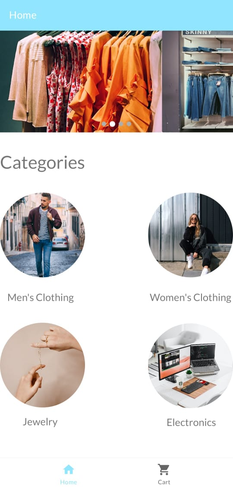
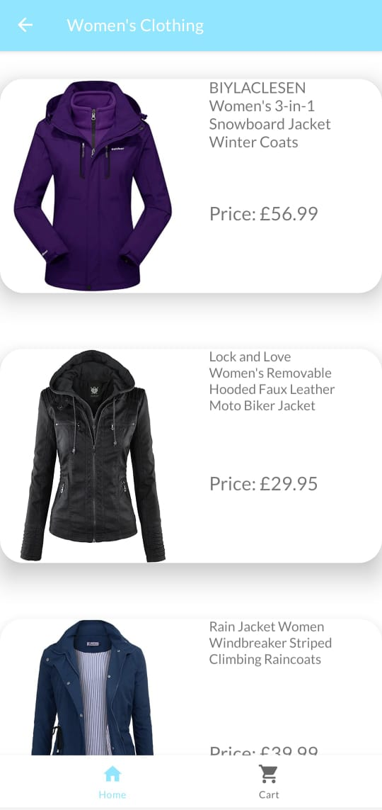
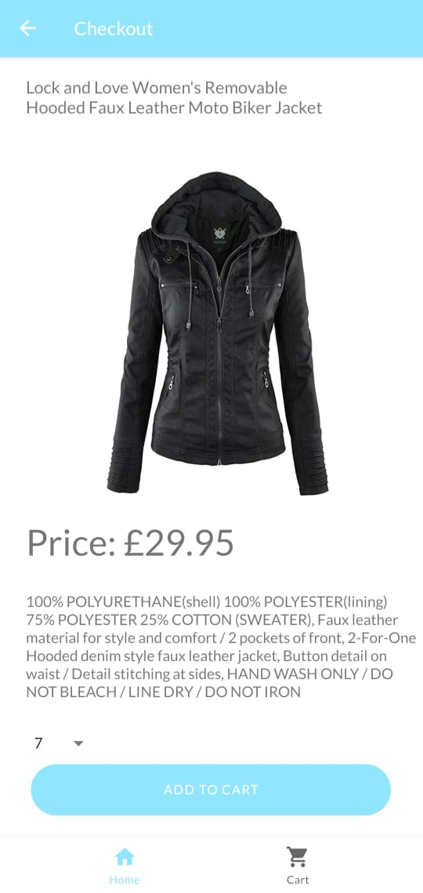
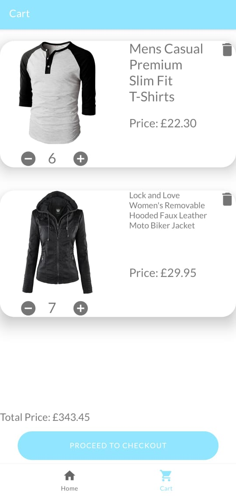
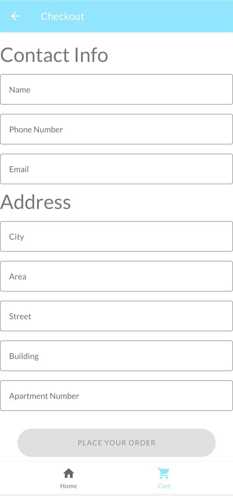
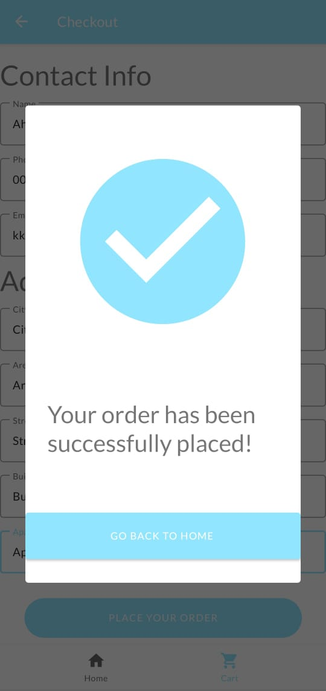

# Ecommerce App
An Android ecommerce app built with Kotlin using the latest Android development tools and libraries.
## Screenshots

  

   &nbsp;
   &nbsp;
   &nbsp;
   &nbsp;
  
  

## About

This app greets users with the home page that contains 4 categories: Men's Clothing, Women's Clothing, Jewelry and Electronics. The user chooses a category and can then view the products and their respective images, price and description.

After which, the user can add a product to their cart along with its quanitity. After the user is done browsing, they can navigate to the cart page where the selections will be confirmed.

Afterwards, a checkout page will appear where the user will confirm all their details.

Finally, the order will be confirmed!

## Architecture

This application is done with the [model-view-viewmodel (MVVM) architecture](https://developer.android.com/jetpack/guide).
 

## Technologies and Libraries Used

* [Livedata](https://developer.android.com/topic/libraries/architecture/livedata) - Automatically updates the UI when data changes
* [Recyclerview](https://developer.android.com/guide/topics/ui/layout/recyclerview) - Used for displaying items in a more efficient manner
* [Fragments](https://developer.android.com/guide/fragments) - Exposes the app's UI
* [ViewModel](https://developer.android.com/topic/libraries/architecture/viewmodel) - Holds the data
* [View Binding](https://developer.android.com/topic/libraries/view-binding) - Binds the data to the layouts in the xml
* [Navigation](https://developer.android.com/guide/navigation) - Navigate through the app using bottom navigation view
* [Retrofit](https://square.github.io/retrofit/) - Fetches the data from the REST API
* [Room](https://developer.android.com/training/data-storage/room) - Holds the cart data
* [Coroutines](https://developer.android.com/kotlin/coroutines) - Used to access the API and the local database under the hood
* [Dependency Injection using Dagger-Hilt](https://developer.android.com/training/dependency-injection/) - Inject dependencies in the classes

## API

This application uses the REST API provided by the [Fake Store API](https://fakestoreapi.com/).

> **_Note:_** Since the API used in this application is a fake API, no changes can be made to the database. Hence, cart data had to be stored locally.
